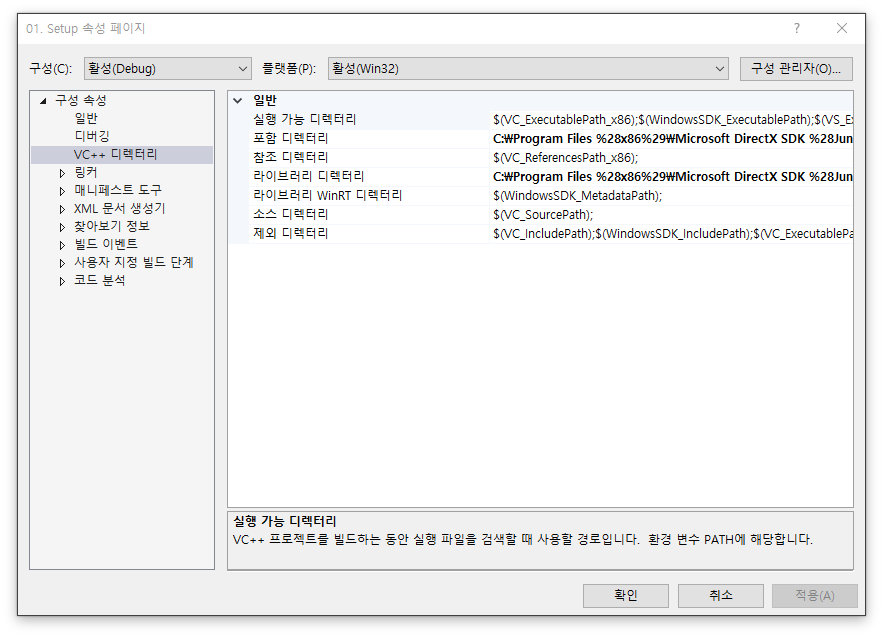

# 1. 프로젝트 설정

게임 개발에 앞서서 프로젝트를 생성하고, 기본적인 설정을 진행합니다.


## 1. 프로젝트 생성 및 설정

1. 새 프로젝트 > Visual C++ -> 빈 프로젝트를 통해 프로젝트를 생성합니다.


2. 생성 후 우측 솔루션 탐색기에서 프로젝트 우클릭 후 속성 페이지를 열어주세요.


프로젝트 기본 값 > 문자 집합을 유니코드 문자 집합 사용으로 변경하세요.

문자 집합이란 문자열을 어떤 형태로 처리할지 구분하는 것으로 위 설정은 문자 집합을 유니코드(한 문자당 2바이트)로 사용하겠다는 설정입니다.




구성 속성 > VC++ 디렉터리에서 포함 디렉터리와 라이브러리 디렉터리에 DirectX SDK 경로를 추가합니다.

포함 디렉터리: C:\Program Files (x86)\Microsoft DirectX SDK (June 2010)\Include

라이브러리 디렉터리:  C:\Program Files (x86)\Microsoft DirectX SDK (June 2010)\Lib\x86\


링커 > 입력에 추가 종속성 콤보 박스 클릭후 편집창을 열어 아래 추가 종속성들을 입력하세요.

```
winmm.lib
d3d9.lib
d3dx9.lib
```

기존 Universe2D 프레임워크에서 `Precompiled.cpp` 에 입력된 `#pragma comment(lib, "d3d9.lib")`와 같은 설정으로 동적인 라이브러리를 불러올 수 있도록 합니다.


## 2. 미리 컴파일된 헤더 설정

 참조(include)는 전처리기를 통해서 헤더 파일을 복사하는 역할을 합니다. 미리 컴파일된 헤더(Precompiled Header)는 참조를 모아서 미리 컴파일 해놓음으로 중복하여 참조하지 않도록 하는 역활을 합니다. 또한 한번만 참조(include)함으로 컴파일 시간을 줄일 수 있습니다.

 다만, 이미 컴파일된 미리 컴파일된 헤더에 새로운 헤더를 추가하게 되면 헤더를 다시 만드는 과정이 이루어집니다. 그러므로 바뀔 수 있는 헤더는 추가하지 않는 것이 좋습니다. 이 프로젝트에서 프레임워크 요소들은 바뀌지 않기 때문에 미리 컴파일된 헤더에 정의됩니다.


솔루션 탐색기를 통해 Precompiled.h와 Precompiled.cpp를 생성후 아래 내용과 같이 작성해주세요.


##### 1. Precompiled.h 작성

```c++
#pragma once

#include <Windows.h>
#include <d3d9.h>
#include <d3dx9.h>
#include <stdio.h>
#include <time.h>

#include <string>
#include <vector>
#include <unordered_map>

...다른 헤더 파일
```


##### 2. Precompiled.cpp 작성

```c++
#include "Precompiled.h"	
```


##### 3. 프로젝트 속성 페이지 > 구성 속성 > C/C++ > 미리 컴파일된 헤더


미리 컴파일된 헤더를 `만들기(/Yc)`로 변경하고 헤더 파일을 `Precompiled.h`로 변경한 후 적용을 눌러주세요.


##### 4. 솔루션 탐색기 > Precompiled.cpp > 속성

같은 속성창 같아보이지만 창 이름이 다르니 주의해주세요


## 3. 엔트리 포인트 생성

 프로그래밍 언어에서 엔트리 포인트(Entry Point)는 **프로그램이 시작되는 지점(함수)**를 의미합니다. 수많은 C/C++에서 다루는 `int main()`과 같은 함수와 같습니다. 다만 이 프로젝트에서는 Windows API를 통해 Window를 생성하기 때문에 조금 다른 엔트리 포인트를 작성해야합니다.


##### 1. WinMain.cpp

````c++
#include "Precompiled.h"

INT WINAPI WinMain(HINSTANCE, HINSTANCE, LPSTR, INT)
{
}
````

 이 프로젝트에서는 매개변수를 사용하지 않기 때문에 작성된 엔트리 포인트는 인자 이름을 명시하지 않았습니다. 구체적으로 어떤 값인지 알고 싶다면 참조란에 Win32 API 입문 강좌를 통해 확인해보세요.


## 4. 실행

이후 솔루션 빌드(Ctrl+Shift+B)를 진행하여 설정이 잘 진행되었는지 확인해야합니다.

빌드 후 출력 파일이 잘 생성되었다면, 프로젝트 설정이 잘 진행된 것입니다.


`#include<d3dx9.h>`등 참조 오류가 생겼다면, 프로젝트 설정에 디렉터리가 잘 입력되어있는지 먼저 확인해보세요.


## 참조

[C/C++] 미리 컴파일된헤더(Precompiled Header)? 컴파일 시간을 줄여봅시다! (https://noirstar.tistory.com/12)

Win32 API 입문 강좌 (http://soen.kr/lecture/win32api/lec2/lec2-2-1.htm)
