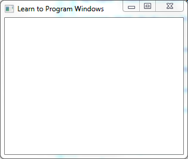
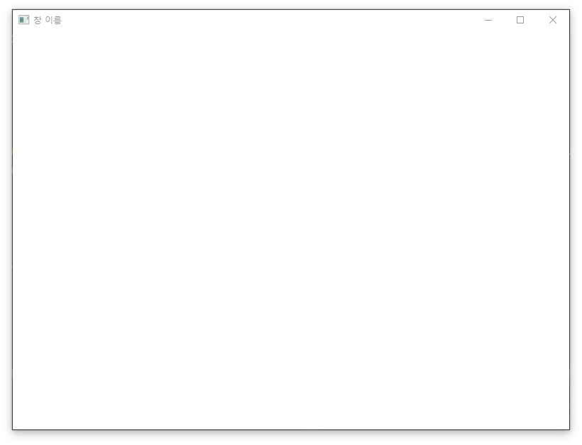

# 02. 윈도우 생성

프로젝트 생성 및 설정에 이어서 윈도우를 생성 과정을 다루는 튜토리얼입니다. 


## 1. 윈도우란?

윈도우는 운영체제를 말하는 것이 아닌 아래와 같이 프로그램이 보여지는 창을 이야기합니다.

 

 마이크로소프트 문서의 설명을 인용하면, 위 이미지는 기본 창으로 창 이름이 포함된 테두리와 최소화, 최대화, 닫기 버튼등이 있는 걸 볼 수 있습니다. 

 운영체제인 Windows는 위와 같은 윈도우와 버튼과 같은 UI 요소 등을 만들어낼 수 있는 API (Application Programming Interface)를 제공합니다. 쉽게 설명하면, Windows에서 프로그램 개발자가 위 이미지와 같은 윈도우 창을 만들어낼 수 있는 함수같은 것들을 제공한다는 것입니다.

 우리는 게임을 구성하기에 앞서,  Windows API를 통해서 화면이 그려질 창을 만들어야합니다.


### 윈도우 핸들(Window Handle)

 윈도우를 만들기 앞서서, 핸들(Handle)에 개념에 대해 알아야할 필요가 있습니다. 핸들이란 윈도우를 구분하는 식별자입니다. Windows에서 창을 관리하기 위해서 창이 만들어질때 발급해주는 열쇠라고 생각하면 편합니다. 물론 창 말고도 이미지, 파일과 같이 다양한 자원을 공유하기 위해서도 핸들을 사용합니다.


## 2. 윈도우 클래스 정의

##### WinMain.cpp

```c++
INT WINAPI WinMain(HINSTANCE, HINSTANCE, LPSTR, INT)
{
	WNDCLASS wc = {};
	wc.lpszClassName = L"Window";
	wc.lpfnWndProc = WndProc;
 	wc.hCursor = LoadCursor(NULL, IDC_ARROW);
}
```

 윈도우를 정의하는 클래스인 WNDCLASS를 생성하고 구분할 이름인 `lpszClassName`과 윈도우 메세지를 처리하는 함수를 지정하는 `lpfnWndProc`를 지정하면 됩니다.

 여기서 WndProc(Window Procedure)는 창 최소화, 최대화, 이동, 마우스 이동과 같이 다양한 이벤트를 처리할 수 있는 함수입니다. 이는 사전에 정의하여 함수를 넘기면 생성된 윈도우에서 등록된 WndProc 함수에 이벤트에 대한 매개변수를 전달해줍니다.

 아래에서 설명할 메세지 루프는 메세지가 없어도 계속해서 반복하기 때문에 마우스 커서가 돌고 있는데, 그래서 계속 hCursor를 통해 마우스 커서 모양을 직접 설정합니다. (이해가 잘 되지 않는다면 완성 후 해당 라인을 주석처리하고 실행해보세요)


아래 함수를 WinMain 함수 위에 정의해주세요.

````c++
LRESULT CALLBACK WndProc(HWND hWnd, UINT Msg, WPARAM wParam, LPARAM lParam)
{
	switch (Msg) {
	case WM_DESTROY:
		PostQuitMessage(0);
		break;
	}

	return DefWindowProc(hWnd, Msg, wParam, lParam);
}
````

 윈도우에서 일어나는 다양한 이벤트는 Msg를 통해 구분될 수 있도록 전달됩니다. Msg의 값은 WM_ 접두사로 정의된 상수들을 통해 구분할 수 있습니다. 윈도우의 생성(WM_CREATE)과 소멸(WM_QUIT, WM_DESTORY)에 대한 메세지도 있고 윈도우에 마우스를 클릭(WM_LBUTTONDOWN)했을 때도 메세지를 통해 전달됩니다.

 위 코드에서는 윈도우가 메모리에서 삭제 될 때 발생하는 WM_DESTROY 메세지를 받았을 때, 메세지 루프가 종료되어 프로그램이 끝날 수 있도록 메세지 루프에 WM_QUIT 메세지를 전달하는 함수를 호출합니다.

 그리고 창 크기 변경, 이동과 같이 기본적인 이벤트를 DefWindowProc 함수를 통해 처리하도록 되어있습니다.


## 3. 윈도우 클래스 등록

다시 WinMain 함수의 최하단으로 이동합니다.

````c++
RegisterClass(&wc);
````

이후 위 함수를 통해 Widows에 wc에 정의된 윈도우가 생성될 것이라는 등록 과정을 진행합니다. 구체적으로 운영체제에서 어떻게 처리하는지는 모르지만, 꼭 필요한 과정입니다.

 또한 wc에 잘못된 인자가 있을 때, 즉 윈도우를 생성할 수 없을 때 등록도 실패하는데 이때 함수에서 0을 반환합니다.


## 4. 윈도우 생성

````c++
HWND handle = CreateWindow(L"Window", L"창 이름", WS_OVERLAPPEDWINDOW, 0, 0, 800, 600, NULL, NULL, wc.hInstance, NULL);
````

 CreateWindow는 윈도우를 메모리에 생성하는 함수로 다양한 인자 값이 들어갑니다. 앞에서 부터 다루면, 맨 앞 인자는 앞서 wc에 입력한 lpszClassName과 같아야합니다. 다음은 윈도우 이름으로 창 제목에 표시될 텍스트입니다. 

 다음 인자인 ` WS_OVERLAPPEDWINDOW`는 생성할 윈도우의 형태를 지정하는 값입니다. 최대화 버튼, 최소화 버튼의 존재 여부나 테두리의 존재 여부 등을 정의할 수 있습니다. wc.hInstance는 프로그램에 대한 핸들로 윈도우를 만드는 프로그램을 지정하는 역활입니다.


## 5. 윈도우 표시

````c++
ShowWindow(handle, SW_SHOWDEFAULT);
````

 ShowWindow에 생성된 윈도우 핸들과 어떤 상태로 표시할지 정하는 상수를 넘겨주면 창이 화면에 표시됩니다. `SW_SHOWDEFAULT`는 활성화된 상태로 다른 상수들은 하단 참조에 WinAPI의 윈도우를 만드는 과정 포스팅을 참조하세요.


## 6. 메세지 루프

```c++
MSG msg = {};
while (msg.message != WM_QUIT)
{
	if (PeekMessage(&msg, NULL, 0, 0, PM_REMOVE))
	{
		TranslateMessage(&msg);
		DispatchMessage(&msg);
	}
}
```

 계속해서 PeekMessage를 통해 메세지 큐에서 메세지를 꺼내고, 메세지를 처리해서 WndProc로 전달해주는 DispatchMessage를 호출합니다. 여기서 TranslateMessage는 키보드에 관한 메세지 처리인데 `WM_KEYDOWN`과 `WM_KEYUP`을 조합하여 눌린 키의 값이 포함된 `WM_CHAR` 메세지를 만들어낸다고 합니다.

 메세지 큐에서 메세지를 꺼내는 함수는 GetMessage와 PeekMessage가 있는데 GetMessage는 메세지 큐가 비어있을 때 메세지를 받을 때까지 기다리지만 PeekMessage를 사용하면 **메세지 큐가 비어있을 때 기다리지 않아서 다른 일을 처리할 수 있도록 할 수 있습니다.** 여기서는 윈도우 메세지가 처리되지 않을 때 게임이 진행되야하므로 PeekMessage를 사용합니다.


## 7. 실행



 실행 후 위와 같이 창이 화면에 생긴다면 윈도우가 잘 생성된 것입니다. 또한 윈도우가 멈춰있지 않고 드래그했을 때, 최소화 버튼 을 눌렀을 때 잘 작동한다면(?) 메세지 루프에 의해 사용자의 이벤트가 잘 처리되고 있음을 알 수 있습니다.

 실행되지 않는다면 아래 코드를 참조해서 다시 시도해보세요.


## 전체 코드

````c++
#include "Precompiled.h"

LRESULT CALLBACK WndProc(HWND hWnd, UINT Msg, WPARAM wParam, LPARAM lParam)
{
	switch (Msg) {
	case WM_DESTROY:
		PostQuitMessage(0);
		break;
	}

	return DefWindowProc(hWnd, Msg, wParam, lParam);
}

INT WINAPI WinMain(HINSTANCE, HINSTANCE, LPSTR, INT)
{
	WNDCLASS wc = {};
	wc.lpszClassName = L"Window";
	wc.lpfnWndProc = WndProc;
	wc.hCursor = LoadCursor(NULL, IDC_ARROW);
	
	RegisterClass(&wc);

	HWND handle = CreateWindow(L"Window", L"창 이름", WS_OVERLAPPEDWINDOW, 300, 300, 800, 600, NULL, NULL, wc.hInstance, NULL);
	ShowWindow(handle, SW_SHOWDEFAULT);

	MSG msg = {};
	while (msg.message != WM_QUIT)
	{
		if (PeekMessage(&msg, NULL, 0, 0, PM_REMOVE))
		{
			TranslateMessage(&msg);
			DispatchMessage(&msg);
		}
	}
}
````


## 참조

[What is a Window? - Mirosoft Docs](https://docs.microsoft.com/en-us/windows/desktop/learnwin32/what-is-a-window)

[윈도우 핸들이란? 프로세스 Windows Handle 설명](https://codingcoding.tistory.com/201)

[WinAPI의 윈도우를 만드는 과정](https://air802.tistory.com/240)